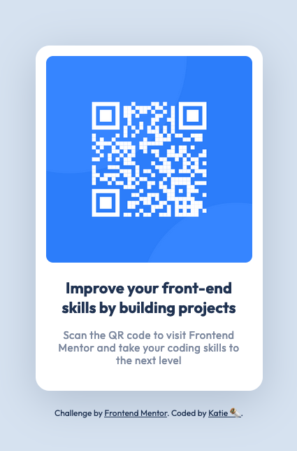

# Frontend Mentor - QR code component solution

This is my solution to the [QR code component challenge on Frontend Mentor](https://www.frontendmentor.io/challenges/qr-code-component-iux_sIO_H). Frontend Mentor challenges help you improve your coding skills by building realistic projects.

## Table of contents

- [Screenshot](#screenshot)
- [Links](#links)
- [Built with](#built-with)
- [What I learned](#what-i-learned)
- [Continued development](#continued-development)
- [Useful resources](#useful-resources)
- [Author](#author)

### Screenshot

### Links

- My Code: [QR Card Component Github](https://github.com/KatieB4/QR-Card-Component--Front-End-Mentor)
- Live Site: [QR Card Component on Github Pages](https://your-live-site-url.com)

### Built with

- Semantic HTML5 markup
- CSS custom properties
- Flexbox
- Mobile-first workflow

### What I learned

For this project, I wanted to practice using Sass and mobile-first development. A focus on mobile or desktop first didn't seem as crucial for this project, as the two layouts are very similar, but it was still good to practice, especially to remember that media queries for mobile-first are written as "min-width" instead of "max-width" when scaling up from the smaller screen sizes.

I've recently been researching more about different unit options, rather than relying on the 62.5% Font-Size Trick. The trick generally seems to work well in the simple solo projects I've been attempthing thus far, and it is certainly easier to manage. However, it doesn't account for some important accessibility issues (when users set their browser to a different font-size percentage, ex: 125%, rather than a different zoom amount, ex 1.25x); might not be translatable when working in a team, using third-party libraries that don't use the same system, or for end-users' browser extensions; and still also requires me to focus on pixels rather than an understanding of how the different units work together (again can be important for team/ third-party use).

### Continued development

- Deciding how best to semantically break up the html (which tags to assign to the different elements)
- Developing a better understanding (and eventually intuition) of best-practice css unit choices

### Useful resources

- I used sass to build this project after completing Jonas Schmedtmann's [Advanced CSS and Sass Udemy Course](https://www.udemy.com/course/advanced-css-and-sass/)
- I also relied a lot on the [MDN](https://developer.mozilla.org/en-US/) and [Sass](https://sass-lang.com/documentation/) documentation for reference and understanding.
- Josh Comeau has a very thorough article about unit selection for CSS: [The Surprising Truth About Pixels and Accessiblity](https://www.joshwcomeau.com/css/surprising-truth-about-pixels-and-accessibility/)

### Author

- Github - [KatieB4](https://github.com/KatieB4)
- Frontend Mentor - [@KatieB4](https://www.frontendmentor.io/profile/yourusername)
